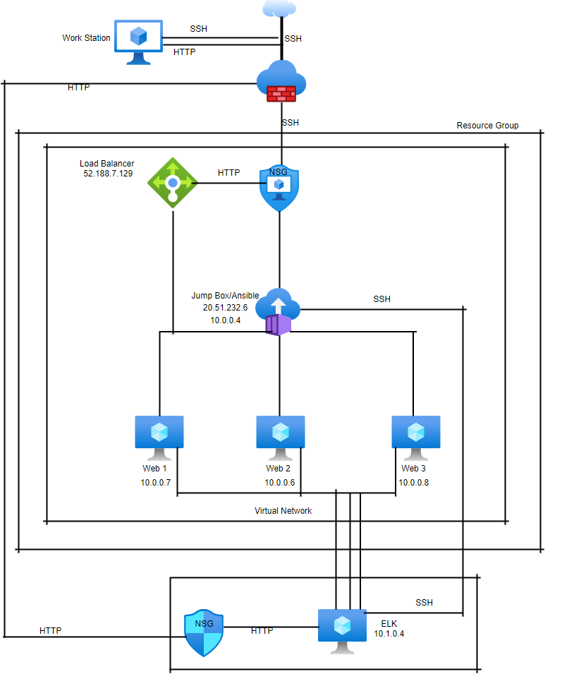
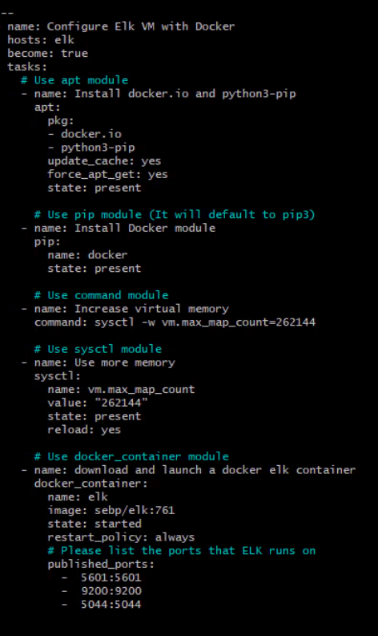
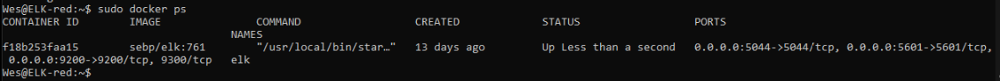

## Automated Elastic Stack Deployment

The files in this repository were used to configure the network depicted below.

These files have been tested and used to generate a live ELK deployment on Azure. They can be used to either recreate the entire deployment pictured above. Alternatively, select portions of the playbook file may be used to install only certain pieces of it, such as Filebeat.

 

This document contains the following details:
- Description of the Topology
- Access Policies
- ELK Configuration
  - Beats in Use
  - Machines Being Monitored
- How to Use the Ansible Build

### Description of the Topology

The main purpose of this network is to expose a load-balanced and monitored instance of DVWA, the D*mn Vulnerable Web Application.

Load balancing ensures that the application will be highly available, in addition to restricting inbound access to the network.
- What aspect of security do load balancers protect? The load balancer can protect against emerging threats and DDoS attacks.
- What is the advantage of a jump box? The jump box acts as a single audit point for web traffic and a place where accounts can be managed.

Integrating an ELK server allows users to easily monitor the vulnerable VMs for changes to the file systems of the VM's on the network and system metrics.
- What does Filebeat watch for? Filebeat monitors log files or locations that is specified and detects changes of the filesystem. It is used to collect Apache logs and those
- generated by Azure tools Nginx web server and MySQL databases.
- What does Metricbeat record? Metricbeat collects metrics from the system and services and detects changes to the system metrics. For instance, CPU usage, failed SSH login
- attempts,sudo escalation failures and CPU/RAM statistics.

The configuration details of each machine may be found below.
_Note: Use the [Markdown Table Generator](http://www.tablesgenerator.com/markdown_tables) to add/remove values from the table_.

| Name     | Function  | IP Address | Operating System |
|----------|---------- |------------|------------------|
| Jump Box | Gateway   | 10.0.0.4   | Linux            |
| Web-1    | Web Server| 10.0.0.7   | Linux            |              
| Web-2    | Web Server| 10.0.0.6   | Linux            |
| Web-3    | Web Server| 10.0.0.8   | Linux            |
| ELK      | Monitoring| 10.1.0.4   | Linux            |

### Access Policies

The machines on the internal network are not exposed to the public Internet. 

Only the jumpbox machine can accept connections from the Internet. Access to this machine is only allowed from the following IP addresses:
- Public IP address: 20.51.232.6

Machines within the network can only be accessed by each other.
- Allowed Web-1 access to the ELK server and it's public IP address is, 52.188.7.129. 

A summary of the access policies in place can be found in the table below.

| Name     | Publicly Accessible | Allowed IP Addresses |
|----------|---------------------|----------------------|
| Jump Box | Yes                 | 20.51.232.6          |
| ELK      | No                  | 10.1.0.4             |
| Web-1    | No                  | 10.0.0.7             |
| Web-2    | No                  | 10.0.0.6             |
| Web-3    | No                  | 10.0.0.8             |

### Elk Configuration

Ansible was used to automate configuration of the ELK machine. No configuration was performed manually, which is advantageous because...
- you can run a playbook from your cotrol machine and Ansible uses SSH to communicate with the hosts and executes all the tasks (commands). If you are wanting to 
  install updated software on one or several machines, you can write a playbook to install the new software on all the machines, instead of individually.

The playbook implements the following tasks:
- _TODO: In 3-5 bullets, explain the steps of the ELK installation play. E.g., install Docker; download image; etc._
- ...
- ...

The following screenshot displays the result of running `docker ps` after successfully configuring the ELK instance.

### Target Machines & Beats
This ELK server is configured to monitor the following machines:
- The ELK server is configured to monitor Web-1, Web-2 and Web-3 VM's at 10.0.0.7, 10.0.0.6 and 10.0.0.8, respectively.

We have installed the following Beats on these machines:
- Filebeat
- Metricbeat

These Beats allow us to collect the following information from each machine:
- Filebeat allows us to generate and organize log files and logs information in regards to the filesystem. Including which files have been changed and when.
- Metricbeat detects failed SSH logins, CPU usage and sudo escalation failures and collects this information in the system and service metrics.

### Using the Playbook
In order to use the playbook, you will need to have an Ansible control node already configured. Assuming you have such a control node provisioned: 

SSH into the control node and follow the steps below:
- Copy the playbook file to the Ansible Control Node.
- Update the _____ file to include...
- Run the playbook, and navigate to ____ to check that the installation worked as expected.

_TODO: Answer the following questions to fill in the blanks:_
- _Which file is the playbook? Where do you copy it?_
- _Which file do you update to make Ansible run the playbook on a specific machine? How do I specify which machine to install the ELK server on versus which to install Filebeat on?_
- _Which URL do you navigate to in order to check that the ELK server is running?
- http://20.80.88.208:5601/app/kibana

_As a **Bonus**, provide the specific commands the user will need to run to download the playbook, update the files, etc._
